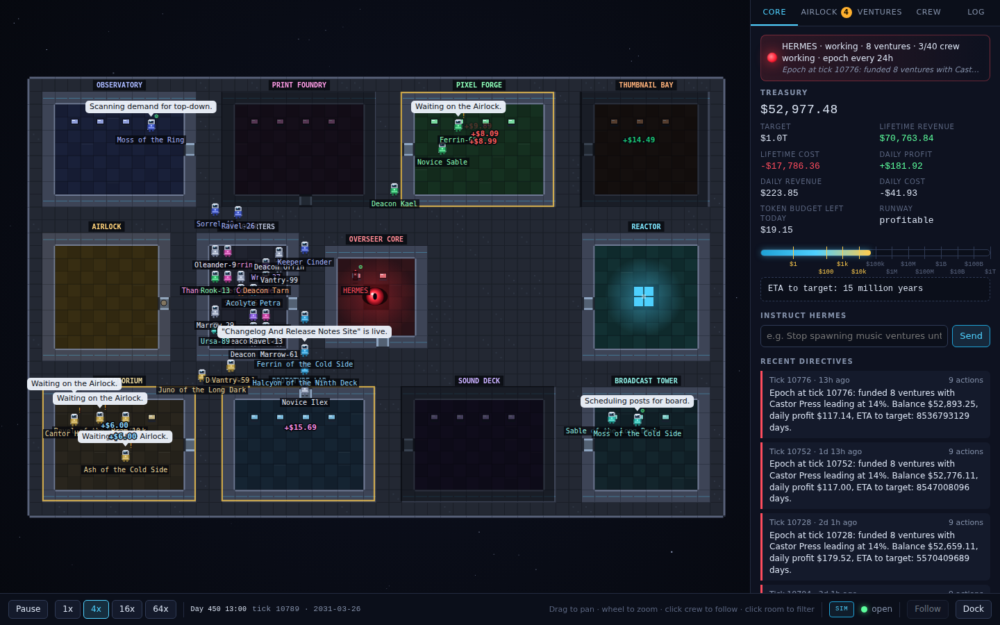

# Eternity Station

A space station rendered as a 2D game, crewed by AI agents running real micro-businesses, ruled by an Overseer whose only power is to move the budget.



## The 60-second pitch

HERMES sits in the core. It does not motivate anyone; it allocates. Around it, crews of agents work in themed rooms: the Print Foundry makes print-on-demand designs for Etsy, the Pixel Forge ships 2D asset packs to itch.io, the Thumbnail Bay drafts Fiverr gigs, the Scriptorium writes affiliate articles, the Prototype Lab builds software templates, the Sound Deck makes music packs. Every task costs tokens. Every sale earns revenue. Both hit one ledger.

Every epoch HERMES reads trailing ROI per venture, cuts budget to losers, kills the persistent ones, doubles down on winners, and spawns a new experiment. Nothing publishes, spends, opens an account or talks to a customer without passing the Airlock, the human approval queue. The treasury target defaults to one trillion dollars and the HUD shows the honest ETA at current velocity, which is usually "never". That display is the product: a velocity gauge that keeps the Overseer ruthless and keeps you looking at the numbers.

## Quickstart

Run each line on its own (Windows PowerShell 5.1 does not accept `&&`):

```
pnpm install
pnpm dev
```

`pnpm dev` starts the server and the game together. Open http://localhost:5173. Press `3` for 16x. Sales appear within a simulated week.

With no `.env` file the server runs in sim mode: no credentials, no network, scripted brains, simulated demand. `pnpm sim` starts only the server, for headless runs; do not run it at the same time as `pnpm dev`.

Requires Node 22.13+ and pnpm 10. `pnpm sim --reset` wipes the local SQLite database and workspaces.

## Two modes

| | sim | live |
|---|---|---|
| Brains | scripted, deterministic, free | Claude workers (`WORKER_MODEL`, default claude-sonnet-5) |
| HERMES | deterministic allocator | allocator plus a Claude advisor (`OVERSEER_MODEL`, default claude-opus-5) bounded by policy |
| Demand | market simulator, inflated by `SIM_DEMAND_MULTIPLIER` (labelled in the HUD) | real sales polled from connected platforms |
| Airlock | low-risk items auto-approve after 6 ticks unless `AUTO_APPROVE=false` | nothing auto-approves |
| Platforms | mock adapter | real adapters where credentials exist; draft-only paste payloads elsewhere |
| Cost | $0 | capped by `DAILY_TOKEN_BUDGET_CENTS` plus your Anthropic console limit |

Before switching to live, read `docs/05-runbook.md` section 4. The default clock runs a simulated day in 12 real seconds, which is right for the sim and wrong for real money.

## The honest disclaimer

The combined yearly sales of Etsy, Fiverr, Gumroad and itch.io are about thirteen billion dollars. The trillion-dollar target is unreachable by construction and the software says so on screen. A single well-run venture earns between nothing and a few thousand dollars a month after a year. Tokens are cheap; distribution and your own daily ten minutes at the Airlock are what limit the number. Platform bans are the biggest risk and every platform requires a human seller of record, so the agents draft and you publish. `docs/01-economics-reality-check.md` has the numbers with sources.

## Repository

```
apps/station        Vite + Canvas 2D client (no framework, no asset files)
packages/core       pure domain: types, map, RNG, economics, market, ledger, allocation, playbooks
packages/adapters   PlatformAdapter per marketplace (mock, real, draft-only, manual)
packages/server     clock, orchestrator, brains, Overseer, Airlock, SQLite, REST + WS
docs/               the documents below
```

`pnpm typecheck` and `pnpm test` run across every package. The server serves `apps/station/dist` in production (`pnpm build && NODE_ENV=production pnpm start`).

## Docs

- [00 Start here](docs/00-START-HERE.md): what this is, sim then live, the one-screen tour
- [01 Economics reality check](docs/01-economics-reality-check.md): platform sizes, take rates, per-venture revenue, token cost, break-even, why the target is a mirror
- [02 Architecture](docs/02-architecture.md): station map, tick loop, data model, HERMES's two layers, Airlock state machine, failure modes
- [03 Venture playbooks](docs/03-venture-playbooks.md): per kind, what sells, what gets you banned, pipeline, first 30 days, kill criteria
- [04 Platform constraints](docs/04-platform-constraints.md): API and ToS reality per platform, what only you can do
- [05 Runbook](docs/05-runbook.md): daily Airlock routine, weekly review, live-mode checklist, security, troubleshooting
- [Module contracts](docs/architecture/CONTRACTS.md): the agreement between packages

## Configuration

Copy `.env.example` to `.env`. Everything has a safe default; `MODE=sim` works with no keys and no network. Platform credentials are optional one by one; a missing key turns that platform into a draft-only adapter that hands you a copy-paste payload in the Airlock. Keys live in `.env` only.
